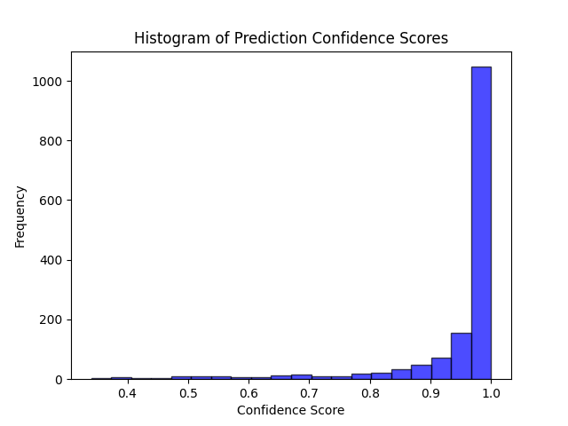
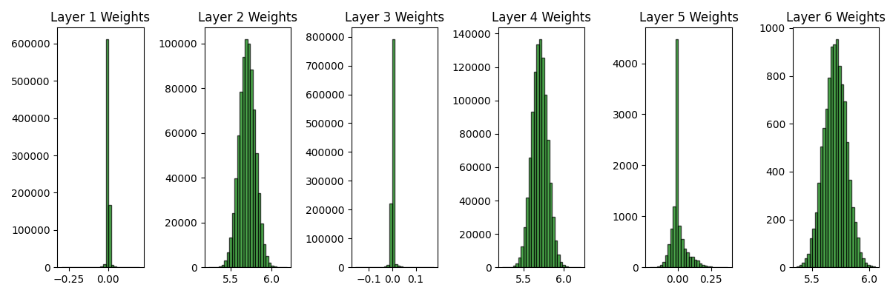
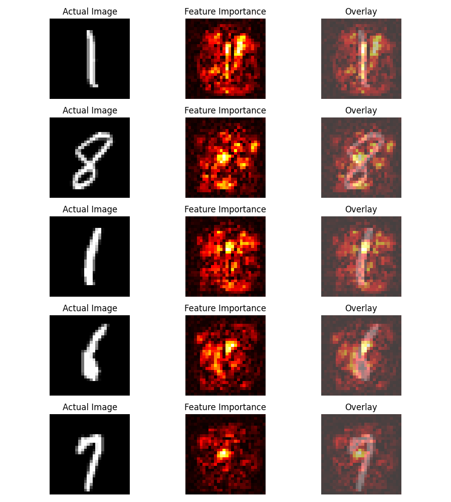
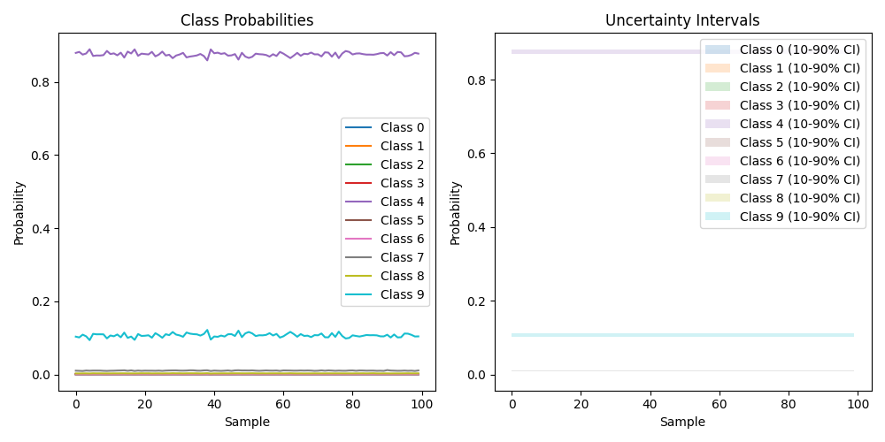

# Bayesian Neural Networks with Uncertainty measure

This project implements a Bayesian approach to neural network classification on the MNIST dataset. By incorporating weight uncertainty into neural networks, we enable the model to express uncertainty in its predictions, providing a more nuanced understanding of its decision-making process.

## Overview of the Research

Traditional neural networks use fixed values for weights, leading to models that are often overconfident in their predictions. This research explores a Bayesian treatment of neural networks, allowing for a distribution over weights, which introduces the notion of uncertainty into the model's predictions. This is achieved through a novel variational inference method known as "Bayes by Backprop."

## Project Structure

- `BayesianNeuralNetwork`: The core class that defines the Bayesian neural network architecture.
- `nonlinearity`, `log_gaussian`, `log_gaussian_logsigma`, `get_random`, `log_categ`: Utility functions for the model's operations.
- Main training loop: Code block that prepares the MNIST dataset, initializes the Bayesian Neural Network, and conducts the training process.
- Visualization: Scripts to generate various plots for analyzing the model's performance and behavior.

## Visualization Results

*Figure 1: Weight distributions across different layers of the Bayesian Neural Network.*

*Figure 2: Feature importance maps for a subset of MNIST digits, illustrating which pixels influence the model's predictions.*

*Figure 3: Histogram of prediction confidence scores, showcasing the model's certainty in its predictions.*

*Figure 4: Probabilities and uncertainty intervals for each class across multiple samples, providing insight into the model's certainty across different classes.*

## Requirements

- Python 3.x
- PyTorch
- NumPy
- Matplotlib
- scikit-learn

## Usage

To run the project, execute the main script:
`python bayesian_nn_script.py`

This will start the training process and display the visualizations upon completion.

## Citation

If you find this work useful, please cite the original paper: https://arxiv.org/abs/1505.05424
`@misc{blundell2015weight,
      title={Weight Uncertainty in Neural Networks}, 
      author={Charles Blundell and Julien Cornebise and Koray Kavukcuoglu and Daan Wierstra},
      year={2015},
      eprint={1505.05424},
      archivePrefix={arXiv},
      primaryClass={stat.ML}
}`
